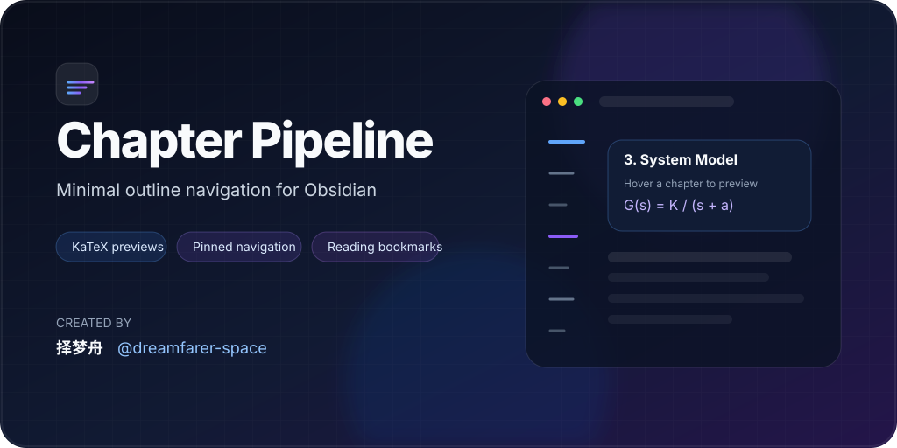

<div align="center">

# 🪐 Chapter Pipeline

**Minimalist Linear-style outline navigation for Obsidian**

Floating heading dashes · KaTeX previews · pinned-top navigation · reading bookmarks

[](https://github.com/dreamfarer-space/obsidian-chapter-pipeline/releases)
[](https://github.com/dreamfarer-space/obsidian-chapter-pipeline/releases)
[](https://obsidian.md)
[](LICENSE)

**English** · [简体中文](README.zh-CN.md)



</div>

## Overview

Chapter Pipeline turns long Obsidian notes into a compact, margin-mounted navigation rail. Instead of a permanent outline sidebar, headings are represented as lightweight horizontal dashes beside the note. Hover a dash to preview the section, including KaTeX math; click it to jump to the heading and keep it pinned near the top of the viewport.

It is designed for long technical notes, research documents, study material, documentation, and any workflow where you want fast chapter navigation without giving up screen space.

## What's new in v1.2.1

- **Faster large-note scroll tracking** — Reading View now caches resolved headings and advances from the previous active chapter instead of rescanning every heading on each frame.
- **Cheaper Live Preview tracking** — rendered CodeMirror candidates are cached, active chapters are located with binary search, and unrelated DOM mutations no longer trigger full candidate rescans.
- **Performance regression coverage** — dedicated tests exercise 1,000-heading documents and verify bounded DOM queries and geometry reads.
- **Stronger repository automation** — CI now covers dependency auditing, strict TypeScript checks, tests, production builds, and generated-bundle consistency, alongside CodeQL, Dependabot, semantic PR checks, and CodeRabbit review.
- **Cleaner documentation** — the English and Simplified Chinese documentation are now maintained as separate README files.

See [Releases](https://github.com/dreamfarer-space/obsidian-chapter-pipeline/releases) for the full version history.

## Core features

### Minimal outline rail

- Floating horizontal dashes represent `H1`–`H6` headings without a bulky sidebar.
- Heading levels use different lengths and weights for immediate hierarchy recognition.
- Dock the rail on either the left or right margin.
- Automatically hide it in narrow panes so split-screen layouts stay clean.

### Hierarchy and progress

Three display modes are available:

- **Focus Mode** — deeper headings stay folded until the rail is hovered.
- **All Headings** — show every heading up to the configured maximum level.
- **Active Branch Only** — expand only the branch around the section currently being read.

An optional vertical progress rail and active indicator make the current position visible without turning the UI into a full minimap.

### KaTeX hover previews

- Hover or keyboard-focus a dash to open a compact chapter card.
- Preview the heading plus a short excerpt from the section.
- Inline and multiline LaTeX are rendered with Obsidian's KaTeX pipeline.
- Excerpt truncation preserves math delimiters and multiline formula row breaks.

### Pinned-top navigation

Clicking a chapter works in both:

- **Reading View**
- **Live Preview / Source Editing View**

Navigation uses calibrated scrolling so the destination heading settles consistently near the top of the active pane, including notes affected by Obsidian's lazy rendering.

### Chapter palette and keyboard navigation

Use the command palette to search and jump between chapters, or bind shortcuts for previous/next chapter navigation. The chapter palette supports hierarchy badges, formula previews, and filters for heading level and bookmarks.

### Reading progress and bookmarks

Optional local-only reading state can store:

- the last chapter you were reading;
- **Revisit** markers;
- **Important** markers.

This data stays in plugin storage. Chapter Pipeline does not modify your Markdown or Frontmatter, and deleted-note records can be cleaned automatically or manually.

### Tactile interaction

A lightweight Web Audio synthesizer can provide subtle micro-switch feedback when navigating or crossing chapter boundaries. Sound can be disabled or adjusted in Settings.

## Installation

Chapter Pipeline is being prepared for Obsidian Community Plugins. Until it is approved there, use BRAT or a manual GitHub Release install.

### BRAT

1. Install and enable **BRAT** from Obsidian Community Plugins.
2. In BRAT, choose **Add Beta plugin**.
3. Enter `dreamfarer-space/obsidian-chapter-pipeline` and add the plugin.
4. Enable **Chapter Pipeline** under **Settings → Community Plugins**.

### Manual installation

1. Download `chapter-pipeline-<version>.zip` from the latest [GitHub Release](https://github.com/dreamfarer-space/obsidian-chapter-pipeline/releases/latest), or download `main.js`, `manifest.json`, and `styles.css` separately.
2. Place the three plugin files in:

```text
<YourVault>/.obsidian/plugins/chapter-pipeline/
```

3. Reload Obsidian and enable **Chapter Pipeline** under **Settings → Community Plugins**.

## Commands

All commands can be assigned custom hotkeys in **Settings → Hotkeys**.

| Command | Purpose |
| --- | --- |
| `Chapter Pipeline: Jump to previous chapter` | Jump to the previous heading. |
| `Chapter Pipeline: Jump to next chapter` | Jump to the next heading. |
| `Chapter Pipeline: Search & switch chapter` | Open the fuzzy chapter palette. |
| `Chapter Pipeline: Resume last chapter` | Return to the locally saved reading position. |
| `Chapter Pipeline: Toggle revisit bookmark for current chapter` | Toggle a Revisit marker. |
| `Chapter Pipeline: Toggle important bookmark for current chapter` | Toggle an Important marker. |
| `Chapter Pipeline: Clear reading progress & bookmarks for current note` | Remove local reading state for the active note. |
| `Chapter Pipeline: Clean up invalid reading progress & bookmarks` | Remove stale records for deleted or moved notes. |

## Settings

<details>
<summary><strong>Show settings reference</strong></summary>

| Setting | Default | Description |
| --- | --- | --- |
| Show excerpt preview | On | Show a short section excerpt in the hover card. |
| Ignore first H1 | Off | Skip the note-title H1 when building the rail. |
| Dock position | Left | Place the rail on the left or right margin. |
| Heading hierarchy mode | Focus Mode | Choose Focus, All Headings, or Active Branch Only. |
| Show vertical progress rail | Off | Display the reading-position guide. |
| Reading progress & bookmarks | Off | Store local resume points and chapter markers. |
| Tooltip glassmorphism | On | Enable backdrop blur and spring-style tooltip motion. |
| Max heading level | H2 | Limit which heading levels appear in the rail. |
| Active indicator color | Azure | Select a preset, theme accent, or custom color. |
| Narrow-view auto-hide threshold | 600 px | Hide the rail below the configured pane width. |
| Tactile sound | On | Enable synthesized interaction sounds. |
| Sound volume | 50% | Set tactile feedback volume. |

</details>

## Performance and accessibility

Chapter Pipeline is built to keep per-frame work small on large documents:

- passive, `requestAnimationFrame`-coalesced scroll handling;
- cached Reading View heading resolution;
- cached Live Preview chapter candidates;
- incremental or binary-search active chapter lookup;
- mutation filtering so irrelevant editor DOM changes do not rebuild caches;
- bounded parsing caches and deterministic listener/resource cleanup.

The UI also supports keyboard focus, screen-reader semantics, reduced-motion preferences, forced-colors mode, touch-friendly tooltip behavior, and contrast-aware active indicators.

## Development

The plugin source is TypeScript under `src/`, bundled to the committed CommonJS `main.js` entry point used by Obsidian.

```bash
npm ci
npm run build
npm test
npx --no-install tsc --noEmit
```

Repository CI additionally verifies that a production build does not leave an uncommitted `main.js` diff.

Architecture and implementation notes live in [`docs/`](docs/):

- [`PHASE1_MIGRATION.md`](docs/PHASE1_MIGRATION.md) — typed module migration boundary
- [`PHASE2_PERFORMANCE.md`](docs/PHASE2_PERFORMANCE.md) — performance work
- [`PHASE3_COMPLIANCE_AUDIT.md`](docs/PHASE3_COMPLIANCE_AUDIT.md) — compliance and lifecycle audit
- [`PHASE4_UI_UX.md`](docs/PHASE4_UI_UX.md) — UI/UX, motion, touch, and accessibility notes
- [`COMMUNITY_SUBMISSION.md`](docs/COMMUNITY_SUBMISSION.md) — release and compatibility checklist for Community Plugins submission

## Privacy

Chapter Pipeline does not require an external service. Reading progress and bookmarks are stored locally by Obsidian's plugin data API and are disabled by default.

## License

[MIT](LICENSE) © 2026 [择梦舟](https://github.com/dreamfarer-space)
