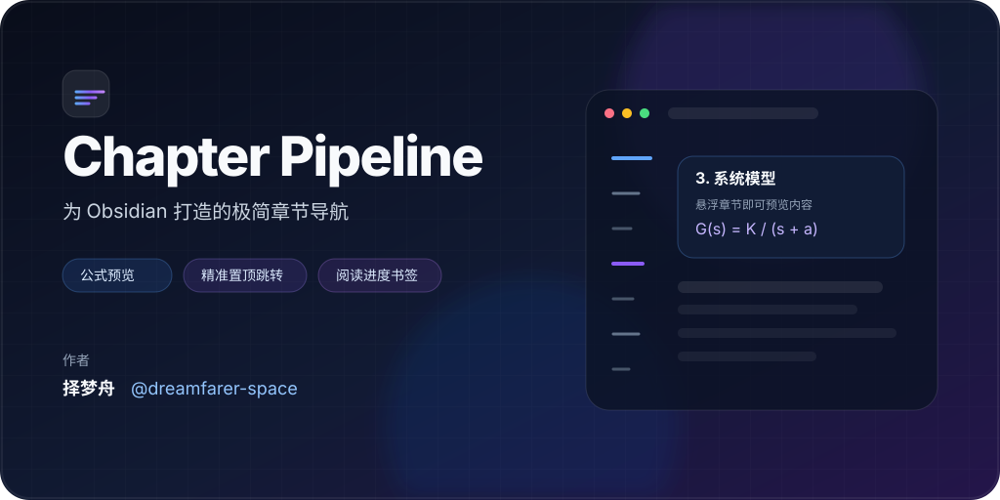

<div align="center">

# 🪐 Chapter Pipeline

**为 Obsidian 打造的 Linear 风格极简章节导航**

悬浮章节横线 · KaTeX 公式预览 · 精准置顶跳转 · 阅读进度与书签

[](https://github.com/dreamfarer-space/obsidian-chapter-pipeline/releases)
[](https://github.com/dreamfarer-space/obsidian-chapter-pipeline/releases)
[](docs/COMMUNITY_SUBMISSION.md)
[](LICENSE)

[English](README.md) · **简体中文**



</div>

## 简介

Chapter Pipeline 把 Obsidian 长笔记的目录导航压缩成一条贴在正文边缘的极简章节轨道。它不会长期占用一个侧边栏，而是使用一列轻量的横线表示各级标题：悬浮即可预览章节内容与 KaTeX 数学公式，点击即可跳转到目标标题，并稳定停靠在当前视图顶部附近。

它尤其适合长篇技术笔记、论文与科研记录、考研/课程资料、项目文档，以及任何需要频繁在章节之间跳转、又不希望目录占据屏幕空间的场景。

## 1.2.3 更新

- **Obsidian 审核加固**：针对审核 blocker 做修正，并刷新当前 `1.2.3` 发布包的版本元数据。
- **UI 实现清理**：将 Tooltip 层级样式移到插件 CSS，并使用 Obsidian Settings 组件 API 生成设置页标题。
- **发布元数据保持一致**：插件 ID 仍为 `chapter-pipeline`，`minAppVersion` 仍为 `0.15.9`，移动端继续通过 `isDesktopOnly: true` 暂不声明支持。
- **兼容性证据明确区分**：最近一次有记录的真实 Obsidian smoke test 仍针对打包后的 `1.2.2`；具体测试矩阵见提交清单，不把它误写成一次独立的 `1.2.3` 真 App 测试。

完整历史请查看 [GitHub Releases](https://github.com/dreamfarer-space/obsidian-chapter-pipeline/releases)。

## 核心功能

### 极简章节轨道

- 使用悬浮横线表示 `H1`–`H6`，不需要常驻目录侧边栏。
- 不同标题层级使用不同长度和粗细，一眼即可辨认层级。
- 支持停靠在正文左侧或右侧。
- 窄窗口自动隐藏，分屏阅读 PDF 或资料时不会遮挡正文。

### 层级折叠与阅读进度

提供三种章节显示模式：

- **专注模式**：默认折叠深层标题，鼠标移入章节轨道时展开。
- **全部展开**：显示配置范围内的全部标题。
- **仅活动分支**：只展开当前阅读章节所在的层级分支。

还可以开启纵向进度轨道与活动章节指示器，在保持界面克制的同时快速判断当前位置。

### KaTeX 悬浮预览

- 鼠标悬浮或键盘聚焦章节横线，即可打开紧凑的章节卡片。
- 展示标题和短篇正文摘要。
- 支持 Obsidian/KaTeX 的行内与多行 LaTeX 公式渲染。
- 摘要截断会尽量保持数学定界符与多行公式换行结构完整。

### 双模式精准置顶跳转

点击章节可在以下视图中工作：

- **阅读视图（Reading View）**
- **实时预览 / 源码编辑视图（Live Preview / Source Editing）**

插件会结合多帧校准处理 Obsidian 的懒加载与虚拟化，使目标标题稳定落在当前滚动容器顶部附近，而不是只做一次容易偏移的普通滚动。

### 章节搜索与键盘导航

可以通过命令面板打开专用章节搜索器，也可以为“上一章节 / 下一章节”绑定快捷键。章节搜索支持层级标记、公式摘要，以及按标题级别和书签状态筛选。

### 阅读进度与章节书签

可选的本地阅读状态支持保存：

- 上次阅读到的章节；
- **稍后重看（Revisit）** 标记；
- **重要（Important）** 标记。

这些信息仅保存在插件本地数据中，不会修改 Markdown 或 Frontmatter。删除或移动笔记后，也可以自动或手动清理失效记录。

### 轻量触感音效

插件使用 Web Audio 实时合成轻微的微动开关反馈音，无需携带额外音频资源。可以在设置中完全关闭或调整音量。

## 安装

Chapter Pipeline 正在准备提交 Obsidian 社区插件市场。在正式通过审核前，请使用 BRAT 或 GitHub Release 手动安装。

### BRAT

1. 从 Obsidian 社区插件安装并启用 **BRAT**。
2. 在 BRAT 中选择 **Add Beta plugin**。
3. 输入 `dreamfarer-space/obsidian-chapter-pipeline` 并添加插件。
4. 在 **设置 → 第三方插件 / Community Plugins** 中启用 **Chapter Pipeline**。

### 手动安装

1. 从最新 [GitHub Release](https://github.com/dreamfarer-space/obsidian-chapter-pipeline/releases/latest) 下载 `chapter-pipeline-<version>.zip`，也可以分别下载 `main.js`、`manifest.json`、`styles.css`。
2. 将三个插件文件放入：

```text
<你的仓库>/.obsidian/plugins/chapter-pipeline/
```

3. 重载 Obsidian，然后在 **设置 → 第三方插件** 中启用 **Chapter Pipeline**。

## 命令

以下命令都可以在 **设置 → 快捷键** 中绑定：

| 命令 | 用途 |
| --- | --- |
| `Chapter Pipeline: Jump to previous chapter` | 跳转到上一个标题。 |
| `Chapter Pipeline: Jump to next chapter` | 跳转到下一个标题。 |
| `Chapter Pipeline: Search & switch chapter` | 打开章节模糊搜索器。 |
| `Chapter Pipeline: Resume last chapter` | 返回本地保存的阅读位置。 |
| `Chapter Pipeline: Toggle revisit bookmark for current chapter` | 切换“稍后重看”标记。 |
| `Chapter Pipeline: Toggle important bookmark for current chapter` | 切换“重要”标记。 |
| `Chapter Pipeline: Clear reading progress & bookmarks for current note` | 清除当前笔记的本地阅读状态。 |
| `Chapter Pipeline: Clean up invalid reading progress & bookmarks` | 清理已删除或移动笔记留下的失效记录。 |

## 设置

<details>
<summary><strong>展开设置参考</strong></summary>

| 设置项 | 默认值 | 说明 |
| --- | --- | --- |
| 显示章节摘要 | 开启 | 在悬浮卡片中展示短篇正文摘要。 |
| 忽略第一个 H1 | 关闭 | 不把笔记标题 H1 生成到章节轨道。 |
| 停靠位置 | 左侧 | 选择章节轨道位于正文左侧或右侧。 |
| 标题层级模式 | 专注模式 | 可选专注、全部展开或仅活动分支。 |
| 显示纵向进度轨道 | 关闭 | 显示当前阅读位置的纵向参考线。 |
| 阅读进度与书签 | 关闭 | 在本地保存恢复点和章节标记。 |
| 玻璃拟态悬浮卡片 | 开启 | 启用背景模糊和弹性动效。 |
| 最大标题层级 | H2 | 限制章节轨道显示到哪个标题层级。 |
| 活动章节颜色 | Azure | 可选预设色、主题强调色或自定义颜色。 |
| 窄视图自动隐藏阈值 | 600 px | 当前窗格宽度低于阈值时隐藏章节轨道。 |
| 触感音效 | 开启 | 启用合成交互声音。 |
| 音量 | 50% | 调整交互音效音量。 |

</details>

## 性能与可访问性

Chapter Pipeline 尽量把超长文档中的逐帧工作量控制在较低水平：

- 被动滚动监听 + `requestAnimationFrame` 合帧；
- 阅读视图标题元素缓存；
- Live Preview 已渲染章节候选缓存；
- 增量搜索 / 二分搜索定位活动章节；
- 过滤无关编辑器 DOM mutation，避免不必要的缓存重建；
- 有界解析缓存，以及卸载时确定性的监听器与资源清理。

界面同时支持键盘聚焦、屏幕阅读器语义、减少动画偏好、强制颜色模式、触屏悬浮卡片交互和对比度友好的活动指示色。

## 开发

源码使用 TypeScript，位于 `src/`，通过 esbuild 构建为 Obsidian 实际加载的 CommonJS `main.js`。

```bash
npm ci
npm run build
npm test
npx --no-install tsc --noEmit
```

CI 还会验证生产构建后 `main.js` 不会出现未提交差异。

架构与实现记录位于 [`docs/`](docs/)：

- [`PHASE1_MIGRATION.md`](docs/PHASE1_MIGRATION.md)：TypeScript 模块化迁移边界
- [`PHASE2_PERFORMANCE.md`](docs/PHASE2_PERFORMANCE.md)：性能优化记录
- [`PHASE3_COMPLIANCE_AUDIT.md`](docs/PHASE3_COMPLIANCE_AUDIT.md)：合规与生命周期审计
- [`PHASE4_UI_UX.md`](docs/PHASE4_UI_UX.md)：交互、动效、触屏与可访问性
- [`COMMUNITY_SUBMISSION.md`](docs/COMMUNITY_SUBMISSION.md)：当前发布/平台状态与兼容性证据的权威记录

## 兼容性验证

当前 `1.2.3` manifest 声明 `minAppVersion: 0.15.9`、`isDesktopOnly: true`。最近一次有记录的真实 Obsidian smoke matrix 在 2026-09-23 针对打包后的 `1.2.2` 执行，并在官方 Obsidian Desktop `0.15.9` 与 `1.13.7` 上通过。`1.2.3` 保留相同的兼容性/平台元数据，但包含审核与 UI 实现修正，因此这里不会把 `1.2.2` 的结果表述为一次独立的 `1.2.3` 真 App 测试。完整证据见 [`docs/COMMUNITY_SUBMISSION.md`](docs/COMMUNITY_SUBMISSION.md)。当前不声明 Android/iOS 支持。

## 隐私

Chapter Pipeline 不依赖任何外部服务。阅读进度和章节书签通过 Obsidian 插件数据 API 保存在本地，并且默认关闭。

## 许可证

[MIT](LICENSE) © 2026 [择梦舟](https://github.com/dreamfarer-space)
