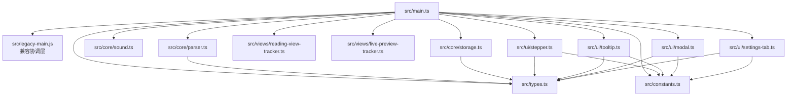

# Phase 1 模块化迁移说明

## 模块依赖

`src/main.ts` 是唯一构建入口。`src/legacy-main.js` 暂时承载已经在生产环境验证过的 Obsidian 协调逻辑，入口将类型化的核心模块挂到同一组 CommonJS 导出上。这样迁移可以按职责逐个替换协调层，而不会改变插件加载方式或现有插件数据。

## 构建与验证

- `npm run build`：esbuild 以 `src/main.ts` 为入口，输出根目录 `main.js`，生产模式压缩并保留 `obsidian` 为运行时外部依赖。
- `npm run dev`：启动 esbuild watch，源文件改动后自动重建。
- `npx tsc --noEmit`：严格模式、ES2022、Node 模块解析的类型检查。
- `npm test`：Node 原生测试套件，当前 48 项全部通过。

## 迁移边界

- `ChapterParser` 保留早期退出扫描、LaTeX 多行压缩和成对 `$` 截断保护。
- `SoundEngine` 在移动端不可用或 AudioContext 被挂起时安全降级，`destroy()` 会关闭上下文。
- `ReadingStorage` 只通过宿主的 `loadData` / `saveData` 读写 `readingState`，删除事件按文件路径和目录前缀清理记录。
- Reading View 与 Live Preview tracker 将滚动读取合并到单个 `requestAnimationFrame`，避免连续滚动触发布局读写。
- Tooltip、Stepper、Modal 和设置页均有独立生命周期入口，后续可从兼容协调层逐步接管。
